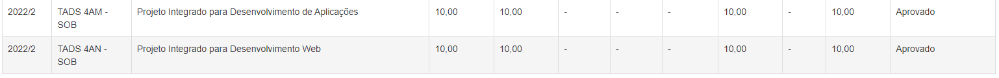

# ProjetosIntegradosProjecao

Os dois projetos que produzi na Faculdade Projecao, incluindo a documentação produzida.
Quando fui avaliado em ambas as disciplinas (Projeto Integrado de Desenvolvimento de Aplicações e Projeto Integrado de Desenvolvimento Web), tirei nota máxima.

## Stack utilizada
Front-end: Angular
Back-end: Laravel
Banco de Dados: MySQL